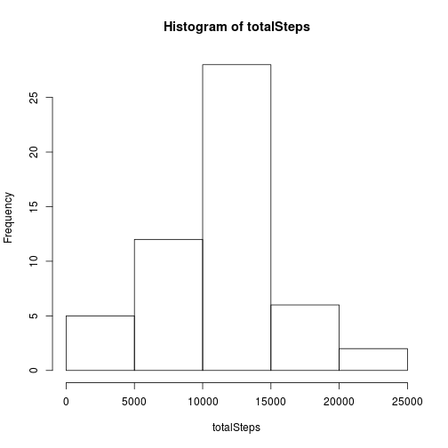
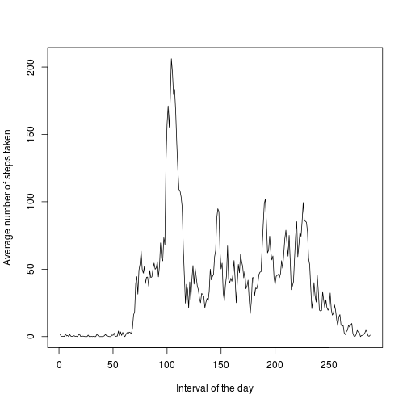
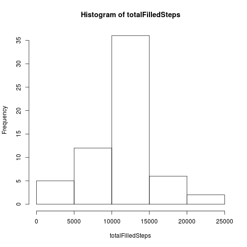
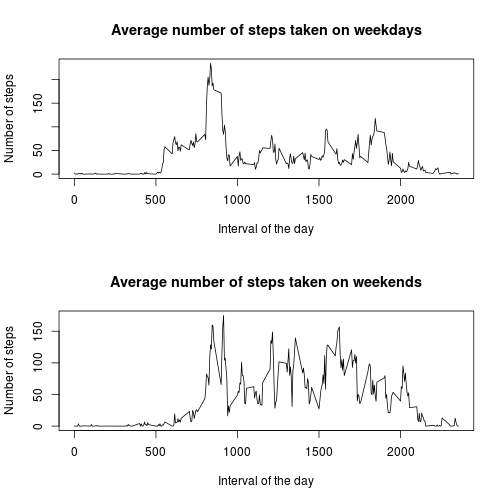

# Peer Assessment 1

## Loading and preprocessing the data

First we need to read data (which has been put in working directory)


```r
data <- read.csv('activity.csv')
```

## What is mean total number of steps taken per day?

Mean steps per day are calculating using tapply function, by splitting
the data according to "date", a factor variable with each
day representing different factor level.


```r
totalSteps <- tapply(data$steps,data$date,sum,simplify=TRUE)
hist(totalSteps)
```

 

```r
mean(totalSteps, na.rm=TRUE)
```

```
## [1] 10766.19
```

```r
median(totalSteps, na.rm=TRUE)
```

```
## [1] 10765
```

## What is the average daily activity pattern?

Average number of steps per interval is calculated using tapply function, using
intervals as factor variables for splitting dataset.


```r
data$interval <- as.factor(data$interval)
meanInterval <- tapply(data$steps,INDEX=data$interval,FUN=mean,na.rm=TRUE)
plot(meanInterval,type="l",xlab='Interval of the day', ylab='Average number of steps taken')
```

 

Finding which 5-minute interval, on average across all the days in the dataset, contains the maximum number of steps:


```r
names(which(meanInterval==max(meanInterval)))
```

```
## [1] "835"
```

## Imputing missing values

Total number of missing values:

```r
sum(is.na(data$steps))
```

```
## [1] 2304
```
Missing values are filled in by creating a new dataset 'dataFilled' and assigning average of corresponding interval to missing value:

```r
dataFilled <- data
for (i in 1:length(data$steps)) {
    if (is.na(data$steps[i])){
        dataFilled$steps[i] <- meanInterval[names(meanInterval)==data$interval[i]]
    }
}
head(dataFilled)
```

```
##       steps       date interval
## 1 1.7169811 2012-10-01        0
## 2 0.3396226 2012-10-01        5
## 3 0.1320755 2012-10-01       10
## 4 0.1509434 2012-10-01       15
## 5 0.0754717 2012-10-01       20
## 6 2.0943396 2012-10-01       25
```

We repeat the same calculation as previously to find average number of steps taken per day
yet this time we use dataset with imputed missing values

```r
totalFilledSteps <- tapply(dataFilled$steps,dataFilled$date,sum,simplify=TRUE)
hist(totalFilledSteps)
```

 

```r
mean(totalFilledSteps)
```

```
## [1] 10766.19
```

```r
median(totalFilledSteps)
```

```
## [1] 10766.19
```

## Are there differences in activity patterns between weekdays and weekends?

Finally we splits days between weekdays and weekends. First we find how different dates correspond to different days of the week from Monday to Sunday:

```r
data$dayOfTheWeek <- weekdays(as.Date(data$date))
```

In the next step we check the name of each weekday (from Monday to Sunday) and assign
a corresponding description of that day - either 'weekday' or 'weekend' - using a for cycle

```r
workday <- c('Pirmadienis','Antradienis','Trečiadienis','Ketvirtadienis','Penktadienis')
endofweek <- c('Šeštadienis','Sekmadienis')
for (i in 1:length(data$dayOfTheWeek)) {
    if (data$dayOfTheWeek[i] %in% workday) data$dayOfTheWeek[i] <- 'weekday'
    if (data$dayOfTheWeek[i] %in% endofweek) data$dayOfTheWeek[i] <- 'weekend'
}
data$dayOfTheWeek <- as.factor(data$dayOfTheWeek)
```

Next we create two datasets to make two plots, one for weekday and another for weekend


```r
dataWeekdays <- data[data$dayOfTheWeek=='weekday',]
dataWeekends <- data[data$dayOfTheWeek=='weekend',]
meanWeekdayInterval <- tapply(dataWeekdays$steps,INDEX=dataWeekdays$interval,FUN=mean,na.rm=TRUE)
meanWeekendInterval <- tapply(dataWeekends$steps,INDEX=dataWeekends$interval,FUN=mean,na.rm=TRUE)
```

and finally we draw plots

```r
par(mfrow=c(2,1))
plot(x=names(meanWeekdayInterval),y=meanWeekdayInterval,xlab = 'Interval of the day',ylab='Number of steps',main='Average number of steps taken on weekdays',type='l')
plot(x=names(meanWeekendInterval),y=meanWeekendInterval,xlab = 'Interval of the day',ylab='Number of steps',main='Average number of steps taken on weekends',type='l')
```

 

End.
